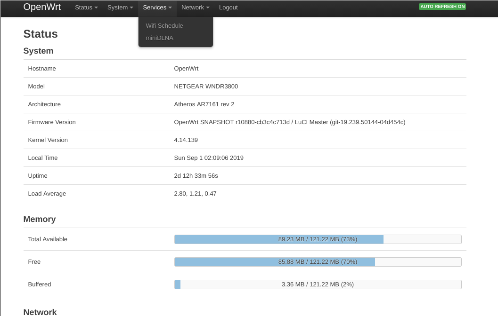

# openwrt_uci
openwrt uci shell
* NOTICE: for chinese user, change timezone from 'UTF' to 'CST-8'
```
config system
        option hostname 'OpenWrt'
        option timezone 'CST-8'
        option ttylogin '0'
        option log_size '64'
        option urandom_seed '0
```
        
        
        
        
* openwrt-ar71xx-tiny-wnr2000v4-squashfs-sysupgrade.bin               
this firmware bin only used for netgear wnr2000v4, add wireguard and led-trigger-netdev support , but remove luci and ipv6 support. you must use vim to edit /etc/config/system   /etc/config/firewall  /etc/config/network  /etc/config/dhcp /etc/config/wireless 

* openwrt-ar71xx-generic-wndr3800ch-squashfs-sysupgrade.bin                 
this firmware bin only used for netgear wndr3800 1chan , add wireguard and led-trigger-netdev support. I will update this firmware frequently.


